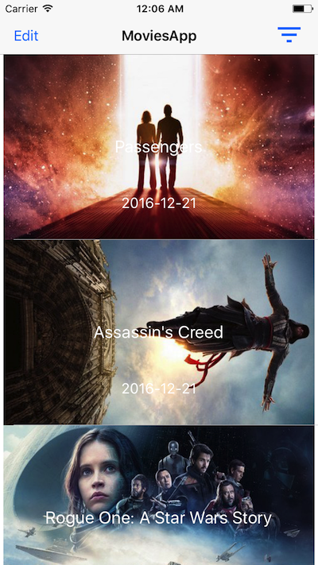

# Movies App

This app uses [The Movie DB](https://www.themoviedb.org/documentation/api) api to get movies list between 
max and min year (default min = 2014 and max = 2016).

## Configuration

- Obtain an Api Key from [The Movie DB](https://www.themoviedb.org/documentation/api).
- Repalce `API_KEY` in `MasterViewController.swift` with your own api key.

## How to run

- This app is using cocoapods dependency manager. Go to the root folder of the app and run `$ pod install`
- Open `DubizzleMoviesApp.xcworkspace` and Run the project! 

## How to Test!
- Press CMD + u to run Unit Tests

## Libraries used

- RealmSwift
- AlamoFire
- KingFisher
- SwityJSON
ß